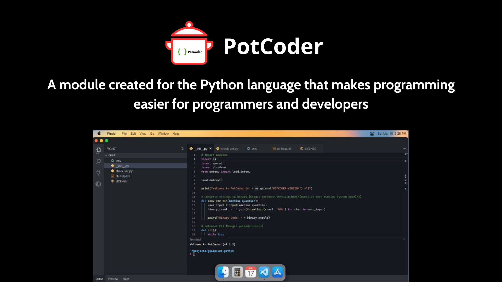

## Requirements
- `Python` version >= `3.8`
- Some additional modules

> Warning: If you import the `potcoder` module in `Python IDLE`, `Python IDLE` will not display information about `potcoder` such as version, .... And when running `potcoder.cli()` it gives `potcoder-UNKOWN` or shows error and doesn't run.

## How to use
Install via `pip` (Recommended):
```
pip install potcoder==1.2.3
```


Install via `whl` file:
- Go to Release > Select latest version of PotCoder > Press the file with the name `potcoder-[potcoder-version]-py3-none-any.whl`
- After download, run this command:
```
pip install potcoder-[potcoder-version]-py3-none-any.whl
```


